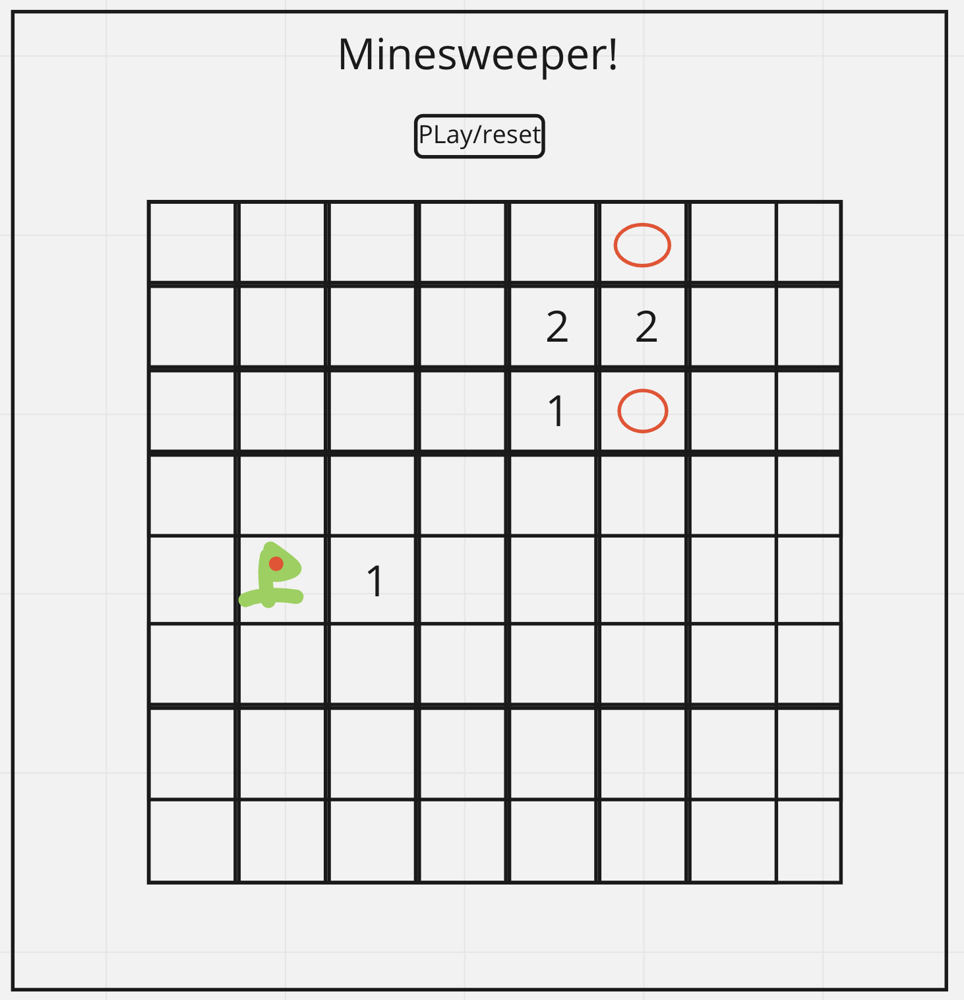

MineSweeper 
===============

In this article I will include the following items for my Minesweeper game. 

1. A wireframe of what the website will look like. 
2. User stories for my Minumum Viable Product.
3. Pseudocode to go along with my MVP user stories.
4. User Stories for both Version 2 and 3. 

Wireframe
---------------------

Here is what the MVP should look like on a very basic level. 

MVP User Stories 
----------------------

As a User I want... 

- to see a 8x8 grid of clickable buttons 

- to be able to click a square and see either a bomb or a number

- to be able to click a button to start or reset the game

- to be able to tell how many bombs are touching the space I clicked by how the number that appears on it

- to be able to flag a bomb to 'diffuse' it

- the game to auto clear large areas without bombs

- to be alerted with a message when I have won or lost

- see a revealed board after have I won or lost

Psuedocode
-------------------

### To see a 8x8 grid of clickable buttons 

    Create a 'div' that will hold the board and have the contents be a 2D array

### To be able to click a square and see either a bomb or a number

    Have a function running off of a click event listener that runs a check whether the object is a bomb and checks the number of bombs surrounding 

    onClick() => {
        IF bomb = true 
        return GameOVER()

        IF bomb = false
        return bombsAdj()
    }

### To be able to click a button to start or reset the game

    Have a button at the end of the javascript that initializes the function 'runGame'

### To be able to tell how many bombs are touching the space I clicked by how the number that appears on it

    Create a  function that uses booleans to check the surrounding array 

    First checking top three, then left and right, lastly bottom three

    Set innerText of minesFound to number of mines found

### To be able to flag a bomb to 'diffuse' it

    Create an event listener on each tile that checks for a right click and places a flag instead of revealing the tile

    onContextMenu() => {
        change tile status to flag
    }

### The game to auto clear large areas without bombs

    Use recursion on the minesFound function to have the function run on adjacent safe blocks until a bomb is found

### To be alerted with a message when I have won or lost

    Have an IF statement the number of bombs 'flagged' against the total number 

    IF all bombs have been flagged reveal board and display "You win" in an alert

    IF any bomb has been reveal board and display "You lose" in an alert

### See a revealed board after have I won or lost

    Upon completion of game via win or loss have board div switch off of hidden 

Version 2 User Stories
--------------------

As a User I want...

- to be able to select from 3 difficuties

- to have a timer for how long I have taken to solve the puzzle

- to be able to change from bombs to another theme (pokemon,colors, super-heros)

Version 3 User Stories
------------------------

As a User I want...

- to see an animation when I hit a bomb

- to hear a sound when I hit a bomb

- want to keep track of my high score