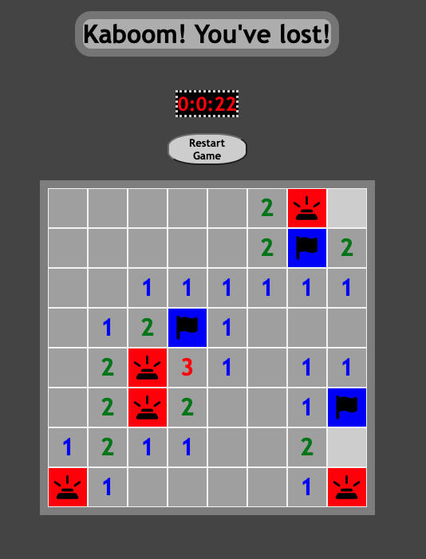

Minesweeper
================

Minesweeper is a quick and fun puzzle game where you try to click all the spaces that don't have mines in them!

## Technology Used

The following tehnology was used to create this version of Minesweeper

- Javascript
- CSS
- HTML

## How to play

To play the game for yourself you can use this https://standarddemacian.github.io/Minesweeper/

When you click on a tile it will display either a number or a mine. The number indicates how many mines are touching that tile. 

You can use right click to place a flag that will disarm the bombs. 

You win when all the spaces other than mines have been revealed!

Want a hint?

 
The corners are the best way to be certain of a mine!

## Next Steps

**Version 2:**

As a User I want...

- to be able to select from 3 difficuties

- to be able to change from bombs to another theme (pokemon,colors, super-heros)

**Version 3:** 

As a User I want...

- to see an animation when I hit a bomb

- to hear a sound when I hit a bomb

- want to keep track of my high score